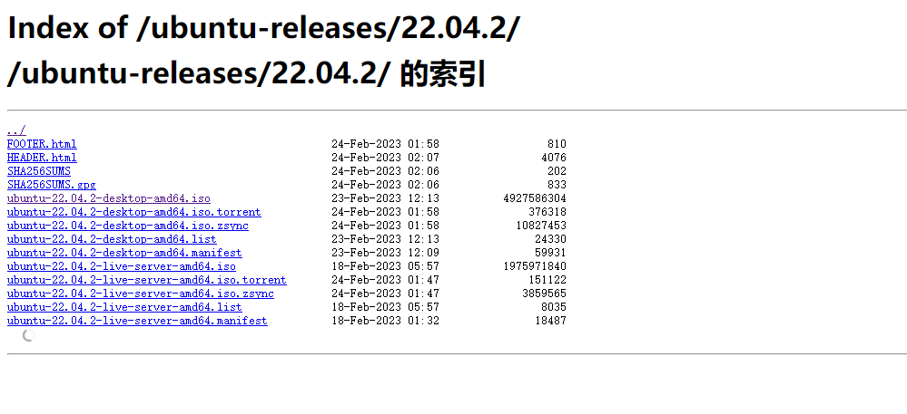
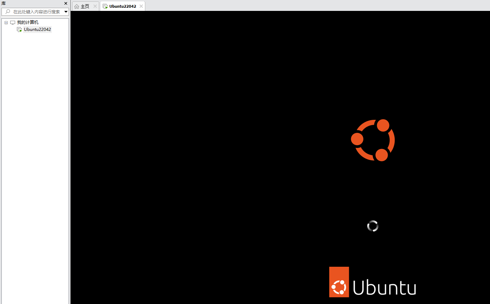
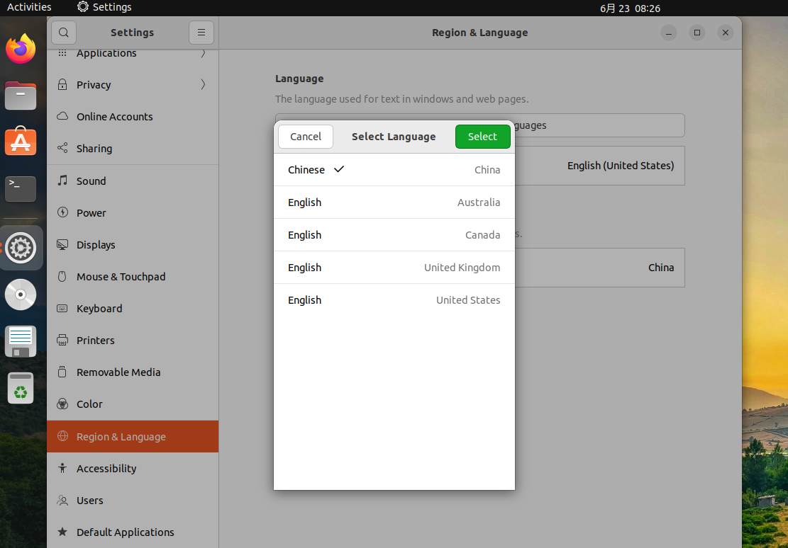
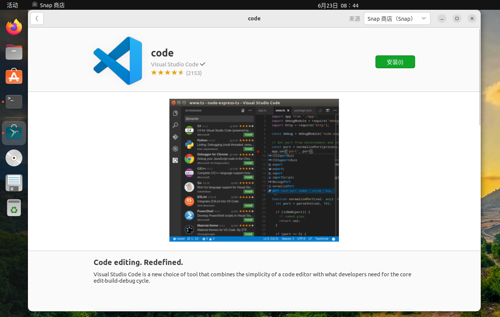
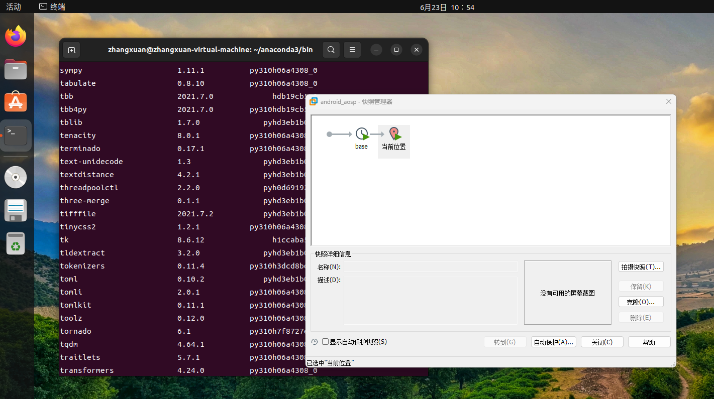
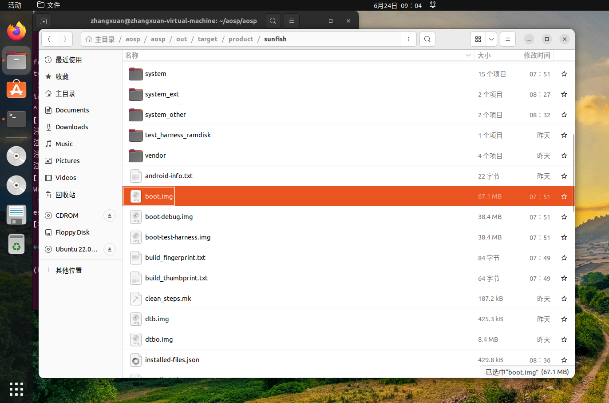

# Aosp编译

在此之前,建议您先了解下环境要求 
- **https://source.android.com/docs/setup/start/requirements?hl=zh-cn**
- **https://source.android.com/docs/setup/start/initializing?hl=zh-cn**
根据要求来说,
- 至少 **500GB** 的硬盘
- 至少需要 16 GB 的可用内存，但 Google 建议提供 64 GB 
- 建议Ubuntu 系统


## 准备 ubuntu
建议通过国内镜像站下载。
比如 ustc :
**https://mirrors.ustc.edu.cn/help/ubuntu-releases.html**

我选择的是 **ubuntu-22.04.2-desktop-amd64.iso** 这携带了桌面


下载完后通过 **VMware** 进行安装。关于 vmware 我就不细说了。


引导进入后我们需要配置一些东西。

### 更改软件源
参考:**https://mirrors.ustc.edu.cn/help/ubuntu.html#ubuntu**

更改 **/etc/apt/sources.list** 文件内容,修改如下
```
# 默认注释了源码仓库，如有需要可自行取消注释
deb https://mirrors.ustc.edu.cn/ubuntu/ jammy main restricted universe multiverse
# deb-src https://mirrors.ustc.edu.cn/ubuntu/ jammy main restricted universe multiverse

deb https://mirrors.ustc.edu.cn/ubuntu/ jammy-security main restricted universe multiverse
# deb-src https://mirrors.ustc.edu.cn/ubuntu/ jammy-security main restricted universe multiverse

deb https://mirrors.ustc.edu.cn/ubuntu/ jammy-updates main restricted universe multiverse
# deb-src https://mirrors.ustc.edu.cn/ubuntu/ jammy-updates main restricted universe multiverse

deb https://mirrors.ustc.edu.cn/ubuntu/ jammy-backports main restricted universe multiverse
# deb-src https://mirrors.ustc.edu.cn/ubuntu/ jammy-backports main restricted universe multiverse

# 预发布软件源，不建议启用
# deb https://mirrors.ustc.edu.cn/ubuntu/ jammy-proposed main restricted universe multiverse
# deb-src https://mirrors.ustc.edu.cn/ubuntu/ jammy-proposed main restricted universe multiverse
```

然后通过下面命令更新一遍
```
sudo apt-get update
sudo apt-get upgrade
```

### 基础设置

右上角设置语言


重启后就ok 了


在 **ubuntu software** 中下载一些你需要的软件。
我肯定是会选 **vscode** 的



### python
为了方便管理 **python** 我选择 **anaconda**。
首先安装 **anaconda** 的依赖 

```
sudo apt install libgl1-mesa-glx libegl1-mesa libxrandr2 libxrandr2 libxss1 libxcursor1 libxcomposite1 libasound2 libxi6 libxtst6
```

参考 **https://mirrors.ustc.edu.cn/help/anaconda.html**
通过 下载 **Anaconda3-2023.03-1-Linux-x86_64.sh**
```
wget https://repo.anaconda.com/archive/Anaconda3-2023.03-1-Linux-x86_64.sh
```
运行
```
bash Anaconda3-2023.03-1-Linux-x86_64.sh
```
按照提示输入 yes 即可
它会安装到 **~/anaconda3**
所以我们设置环境变量 就可以使用 python 了
```
# 设置环境变量追加到 $PATH
export PATH="~/anaconda3/bin":$PATH
# 激活conda
source ~/anaconda3/bin/activate
# 测试python
python --version
Python 3.10.9
# 测试conda 
conda list
```

### 基础环境
参考构建环境 **https://source.android.com/docs/setup/start/initializing?hl=zh-cn**
目前官网只提示了 **Ubuntu 18.04**,先安装再说
```
sudo apt-get install git-core gnupg flex bison build-essential zip curl zlib1g-dev libc6-dev-i386 libncurses5 lib32ncurses5-dev x11proto-core-dev libx11-dev lib32z1-dev libgl1-mesa-dev libxml2-utils xsltproc unzip fontconfig
```

### 快照说明
vmware 可以拍快照,在基础环境准备完后,记得准备下快照,防止以后丢弃aosp 源码方便做回滚操作




## aosp 下载
下载源代码参考: **https://source.android.com/docs/setup/download/downloading?hl=zh-cn**

aosp 个人理解就是 一堆的 **git** 仓库。
可以查看它的清单 **https://android.googlesource.com/platform/manifest**

可以发现它有很多个仓库，如 **bionic,art,frameworks 等等**

但是 **git** 一个个下过于麻烦。所以 google 提供了基于git的代码管理工具 **Repo**。它可以根据 **Manifest** 清单文件统一管理

### 安装Repo
```
# 在用户目录下创建 bin 目录
mkdir ~/bin
# 将bin目录添加到系统环境变量中
PATH=~/bin:$PATH
# 下载repo
curl -sSL  'https://gerrit-googlesource.proxy.ustclug.org/git-repo/+/master/repo?format=TEXT' |base64 -d > ~/bin/repo
# 设置权限
chmod a+x ~/bin/repo
```  

### 镜像下载 aosp
参考: **https://mirrors.ustc.edu.cn/help/aosp.html**

```
第一次同步数据量特别大，如果网络不稳定，中间失败就要从头再来了。所以我们提供了打包的 AOSP 镜像，为一个 tar 包，大约 200G（单文件 200G，注意你的磁盘格式要支持）。这样你 就可以通过 HTTP(S) 的方式下载，该方法支持断点续传。
wget -c "https://mirrors.ustc.edu.cn/aosp-monthly/aosp-latest.tar"
```

接下来就是漫长的等待时间了, 我的大概 **100mb** 预计 2个小时多点时间。

### 检出版本库到本地
将下载好的 aosp 进行解压。
```
tar -xvf aosp-latest.tar
```
解压好后我们设置下同步来源为 **ustc** 镜像站
将 ``.repo/manifests.git/config`` 中的
``url = https://android.googlesource.com/platform/manifest`` 替换成 ``url = git://mirrors.ustc.edu.cn/aosp/platform/manifest``
【你可以通过vscode ``code .repo/manifests.git``打开这个目录,修改更加方便】
本地版本库和远程仓库同步并检出使用下面的命令
```
  git config --global user.email "you@example.com"
  git config --global user.name "Your Name"

#运行 repo init 获取最新版本的 Repo 及其最新的 bug 修复
#如果你是直接下载全量包,那么你应该很快就会初始化成功
repo init -u git://mirrors.ustc.edu.cn/aosp/platform/manifest
#签出 master 分支
repo init -u git://mirrors.ustc.edu.cn/aosp/platform/manifest -b master
#同步源码树，并检出到当前工作目录
repo sync
```

### 检出指定分支
版本库在 ``.repo``中,这是个隐藏文件夹 通过 ``ls -la``进行查看
我们可以看 repo 的清单文件的分支
```
cd .repo/manifests
git branch -a|grep "android-13"
```

关于分支标记可以查看**google**的 **源代码标记和 build** :
**https://source.android.google.cn/docs/setup/about/build-numbers?hl=zh-cn#source-code-tags-and-builds**

我选的是``android-13.0.0_r40``,因为这符合我的主题 **pixel4a** 并且是 **android-13**
```
TQ2A.230405.003.B2	android-13.0.0_r40	Android13	Pixel 4a、Pixel 4a (5G)、Pixel 5、Pixel 5a	2023-04-05
```

那么你应该这样操作
```
repo init -u git://mirrors.ustc.edu.cn/aosp/platform/manifest -b android-13.0.0_r40
# 同步时间很长,但你应该担心的是你磁盘问题
repo sync
```
您也有可能在同步中出现了下面的错误
```
warning: repo is not tracking a remote branch, so it will not receive updates
repo reset: error: Entry 'SUBMITTING_PATCHES.md' not uptodate. Cannot merge.
fatal: 不能重置索引文件至版本 'v2.34.1^0'。
```
这种情况可能是 远程代码出现了更新
你可以通过 ``git status``查看下状态
```
cd .repo/repo 
git status 

您的分支落后 'origin/stable' 共 12 个提交，并且可以快进。
  （使用 "git pull" 来更新您的本地分支）
# 更新下
git pull
```

之后再重新同步下,即可检出到工作目录

## aosp 编译
参考 ``https://source.android.google.cn/docs/setup/build/building?hl=zh-cn#wrong-java-version``
首先仓库里面貌似 自带了 **java**,别给覆盖成不一样的版本
其次我们需要至少 **16G** 内存,但 **16G** 肯定是不够的,所以下面有个解决方案

### 增加swap 内存

swap 交换空间 你可以理解成磁盘上的空间。我们可以利用 磁盘文件的空间 当做一块内存使用。
虽然速度肯定会有影响，但这确实是种解决的办法。

首先我们看下swap 信息:
```
sudo swapon --show
NAME      TYPE SIZE USED PRIO
/swapfile file   2G   0B   -2

sudo free -h
               total        used        free      shared  buff/cache   available
内存：       10Gi       1.0Gi       7.9Gi        40Mi       1.4Gi       9.0Gi
交换：      2.0Gi          0B       2.0Gi


```
可以看到我们使用的交换空间的文件是 /swapfile 并且它只有 **2g** 而我们 内存只有 **10g**。 总共才 **12g** 肯定是不够的。
我们得重新给 swap 分配 16g 才行

按照我下面的指令进行分配:
```
# 关闭交换空间
sudo swapoff -v /swapfile
# 删除交换空间
sudo rm /swapfile

# 查看一下
sudo free -h
               total        used        free      shared  buff/cache   available
内存：       10Gi       1.0Gi       7.9Gi        40Mi       1.4Gi       9.0Gi
交换：         0B          0B          0B

# 分配32G的文件
sudo fallocate -l 32G /swapfile

# 设置权限
sudo chmod 600 /swapfile

# 格式化下
sudo mkswap /swapfile

# 启用交换机
sudo swapon /swapfile

# 在次查看下
sudo swapon --show
sudo free -h
               total        used        free      shared  buff/cache   available
内存：       10Gi       1.0Gi       7.8Gi        40Mi       1.4Gi       8.9Gi
交换：       15Gi          0B        15Gi


# 我们得让它在 系统重启后自动挂载分区
# 修改 /etc/fstab 进行配置
vim /etc/fstab
# 后面追加 /swapfile swap swap defaults 0 0
# 如果已经有了就算了
```


### 初始化构建环境
构建环境不需要我们很复杂的设置。
aosp 中提供了 **envsetup.sh** 来帮我们设置
```
# 在 aosp 中执行下面的命令
source build/envsetup.sh
```

如果你能执行下面的命令,代表初始化成功
```
tapas help
```

### 选择构建目标
使用 ``lunch `` 选择构建目标

构建目标格式为: ``BUILD-BUILDTYPE``
其中 ``BUILD`` 参考 ``https://source.android.google.cn/docs/setup/build/running?hl=zh-cn#selecting-device-build``
```
设备	代号	build 配置
Pixel 6 Pro	raven	aosp_raven-userdebug
Pixel 6	oriole	aosp_oriole-userdebug
Pixel 5	redfin	aosp_redfin-userdebug
Pixel 4a 5G	bramble	aosp_bramble-userdebug
Pixel 4a	sunfish	aosp_sunfish-userdebug
Pixel 4 XL	coral	aosp_coral-userdebug
Pixel 4	flame	aosp_flame-userdebug
Pixel 3a XL	bonito	aosp_bonito-userdebug
Pixel 3a	sargo	aosp_sargo-userdebug
Pixel 3 XL	crosshatch	aosp_crosshatch-userdebug
```
我选择的是 ``aosp_sunfish`` 这符合我的 ``pixel4a``

``BUILDTYPE``选项如下
```
构建类型	    使用情况
user	    权限受限；适用于生产环境
userdebug	与“user”类似，但具有 root 权限和调试功能；是进行调试时的首选编译类型
eng	        具有额外调试工具的开发配置
```

如果你是 ``pixel4a`` 你应该执行下面的命令
```
lunch aosp_sunfish-user
```
当然您也可以直接运行 ``lunch``不过好像没有``user``类型只有``userdebug``
### 开始构建

使用 m 构建所有内容。m 可以使用 -jN 参数处理并行任务。如果您没有提供 -j 参数，构建系统会自动选择您认为最适合您系统的并行任务计数。

执行下面命令
```
m
```

接下来就是漫长的等待。

经过了几个小时,其中出现了**内存溢出**。
将内存在多设置一下,重新 ``m``继续构建即可成功。


构建完的目录位置: ``out/target/product/sunfish/vbmeta.img``



#### 后续问题
一般来说修改代码后重新构建会很快。
如果你想重新构建使用 ``make clean`` 清除一下之前的记录

如果终端闪退 或者 还是内存溢出 建议 ``m -j1``只使用1个内核。可以减少内存使用。
因为他默认好像按照你的内存容量计算内核数来的,这样每个线程占用的内存一起特别高

