# android-pixel4a-刷机系列-(6)出厂镜像编译kernelsu内核

使用 ``userdebug`` 构建的 ``aosp`` 很容易被检测。

``debug_cat``大佬 修改 ``aosp`` 
[http://www.debuglive.cn/article/1076980560838000640](http://www.debuglive.cn/article/1076980560838000640)
修改root 特征,并修正一些系统指纹特征

(您需要将 ``user`` 构建配置 和 ``userdebug`` 配置进行比较,争取还原一致)

这种考验技术功底,``user`` 构建配置 和 ``userdebug`` 差异比较多,只好放弃。

但是都做到这个地步了，所以我们只能尝试用 官方出厂镜像修改,就不折腾``aosp``了,毕竟改了后还得重新编译。

**后面内容就算把所有坑都填上了。**

## 刷入出厂镜像

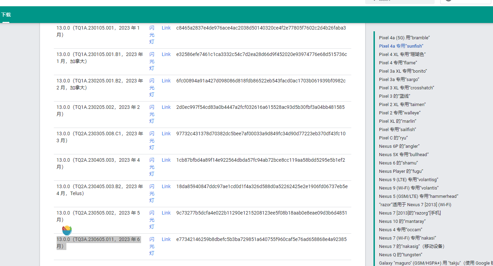

里面包含了完整的驱动二进制文件等等。

我们下载后进行解压(注意区分手机型号):
```
 wget "https://dl.google.com/dl/android/aosp/sunfish-tq3a.230605.011-factory-e7734214.zip?hl=zh-cn" -O "sunfish-tq2a.230405.003.b2-factory-18da8594.zip"

 unzip sunfish-tq2a.230405.003.b2-factory-18da8594.zip 

```


从外部来看这些文件
```
# 里面包含了所有分区镜像
image-sunfish-tq2a.230405.003.b2.zip

# bootloader 引导镜像
bootloader-sunfish-s5-0.5-9430386.img

# 驱动镜像
radio-sunfish-g7150-00108-230117-b-9497111.img

# 刷机脚本
flash-all.sh
```

可以先解压 ``image-sunfish-tq2a.230405.003.b2.zip`` 为后续分析镜像做准备

### 刷机
查看里面的镜像
```
~/pixel4a/image-sunfish-tq2a.230405.003.b2$ ls 

android-info.txt  product.img      system.img        vbmeta_system.img
boot.img          super_empty.img  system_other.img  vendor.img
dtbo.img          system_ext.img   vbmeta.img

```

首先进行刷机
```
# fastboot -w update 命令 需要用到 ANDROID_PRODUCT_OUT 变量,我设置的是解压后的镜像文件,理论上随便设置好像也可以
export ANDROID_PRODUCT_OUT="~/pixel4a/sunfish-tq2a.230405.003.b2/image-sunfish-tq2a.230405.003.b2/"

sh flash-all.sh
```

刷机成功后,变成真正初始状态了。

### (救砖)特别注意

如果你出现刷入出厂镜像 开机不断重启几次 回到 ``fastboot``界面,并且出现红色感叹号。而之前是可以成功刷入这个镜像的,那么可能你分区出现了损坏

**这其实是我出现的问题,当时把我吓尿了**

原因:个人觉得跟 之前使用 ``userdebug``版本有关系。
因为我设置了 ``adb remount`` 并覆盖了 ``vendor``分区中的模块,因为``remount``采用的``overlayfs``堆叠的方式。
我查到了一些很不错的资料:[https://blog.csdn.net/guyongqiangx/article/details/128881282](https://blog.csdn.net/guyongqiangx/article/details/128881282)

所以可能 ``overlayfs``挂载的 ``vendor``依旧未卸载？？？,导致``vendor``的模块不一致？？？

这是我觉得很有可能得事情,可是网上我搜不到任何关于这方面的资料,问``chatgpt``也无济于事。

为了解决这个问题,我考虑了几种方案

- 刷机刷到``b``槽,并激活,但是之前挂载的``vendor``怎么办?所以我放弃了这种
- 刷入完整的 OTA 映像

我采用的第二种:参考官方文档
[https://developers.google.com/android/ota?hl=zh-cn#sunfish](https://developers.google.com/android/ota?hl=zh-cn#sunfish)


```
# 首先下载
wget "https://dl.google.com/dl/android/aosp/sunfish-ota-tq3a.230605.011-a27fab47.zip?hl=zh-cn" -O "sunfish-ota-tq3a.230605.011-a27fab47.zip"
```

下载后如何刷进去呢？这并不是寻常带``img``镜像的包


按照官方介绍说需要进入 ``recovery``模式。

参考:[pixel帮助文档](https://support.google.com/pixelphone/answer/4596836?hl=zh-Hans#zippy=%2C%E4%BD%BF%E7%94%A8%E6%89%8B%E6%9C%BA%E7%9A%84%E6%8C%89%E9%92%AE%E9%AB%98%E7%BA%A7)

```
1.如果您的手机处于开机状态，请按住电源按钮将其关机。
2.同时按住音量调低按钮和电源按钮 10-15 秒。
3.如果按住这两个按钮的时间过长，手机会重启。如果出现这种情况，请从第 1 步重试。
4.使用音量按钮切换菜单选项，直到屏幕上显示“Recovery mode”（恢复模式）。按一次电源按钮即可选择该选项。
5.屏幕上会随即显示“No command”（无命令）。按住电源按钮。在按住电源按钮的同时，按音量调高按钮，然后快速松开这两个按钮。
```

然后按音量键进入 ``apply adb`` ,这样你就可以在 ``recovery``中使用 ``adb``命令

想要将 ``oat``通过 ``adb``进行刷入,请使用``adb sideload sunfish-ota-tq3a.230605.011-a27fab47.zip``   进行刷入

接下来就耐心等待片刻。

接下重新刷入之前的出厂镜像进行测试  ``./flash-all.sh`` 

(如果你进入的是``fastbootd``,那么还需要运行``fastboot reboot bootloader``)

可能它会默认给你刷到``b``槽,为了刷到``a``槽,请在``flash-all.sh``的脚本进行更改


## 修改内核
在出厂镜像中

```
~/pixel4a/image-sunfish-tq2a.230405.003.b2$ ls 

android-info.txt  product.img      system.img        vbmeta_system.img
boot.img          super_empty.img  system_other.img  vendor.img
dtbo.img          system_ext.img   vbmeta.img

```
需要关注两个 ``boot.img`` 和 ``vendor.img``。 这两个分区包含了 ``启动内核`` 以及 ``内核模块``

之前说过``dessert内核`` 中的 ``内核模块`` 并不是通过 ``kmi`` 内核模块接口来与``通用内核(ACK)``进行交互。

由于内核碎片化,导致一旦 下游的 ``内核模块`` 更改,其上游的内核必须适配,后续也很难进行更新修复

所以理论上如果将我们编译好的``启动内核``进行替换 ``boot.img`` 理论上会出现些问题,
比如 ``wifi`` 和 ``相机``等会出现些许情况,甚至可能无法开机


### 选择正确的内核镜像

出厂镜像中的内核版本 可能与 我们当前的不一致,对于非``gki``设备,我们应该争取一致,防止出现预料之外的错误。
(当然,如果是 ``gki``设备,只需要关注 ``kmi``版本即可)

首先进行比对内核版本:

通过 ``grep -a 'Linux version' Image.lz4-dtb``查看我们编译的内核版本
```
initcall_debugLinux version 4.14.295_KernelSU-g0856b718defc 
```
然后再解压原厂``boot.img``,通过``grep -a "Linux version" boot.img-kernel``
```
nitcall_debugLinux version 4.14.302-g1c5bb331fccc-ab9989803 
```
发现有些许差距。

我们进入 git 仓库中查看分支
```
cd ~/aosp/android-kernel/.repo/manifests.git

git branch -r|grep sunfish
  m/android-msm-sunfish-4.14-android13-qpr2 -> origin/android-msm-sunfish-4.14-android13-qpr2
  origin/android-msm-sunfish-4.14-android10-d4
  origin/android-msm-sunfish-4.14-android11
  origin/android-msm-sunfish-4.14-android11-qpr2
  origin/android-msm-sunfish-4.14-android11-qpr3
  origin/android-msm-sunfish-4.14-android12
  origin/android-msm-sunfish-4.14-android12-qpr1
  origin/android-msm-sunfish-4.14-android12-v2-beta-2
  origin/android-msm-sunfish-4.14-android12L
  origin/android-msm-sunfish-4.14-android13
  origin/android-msm-sunfish-4.14-android13-qpr1
  origin/android-msm-sunfish-4.14-android13-qpr2

``` 

发现基于 ``android13``有3个
```
  origin/android-msm-sunfish-4.14-android13
  origin/android-msm-sunfish-4.14-android13-qpr1
  origin/android-msm-sunfish-4.14-android13-qpr2
```
当前我们选的是 ``origin/android-msm-sunfish-4.14-android13-qpr2``

也就是说这已经是最新的了。

为了对应上 ``内核版本`` 我们得寻找最适配的出厂镜像。
先看看 ``log`` 最近提交的记录:
```
git log
commit 36819067aacd91475c699a78d41580f7a17d74b7 (HEAD -> default, origin/android-msm-sunfish-4.14-android13-qpr2, m/android-msm-sunfish-4.14-android13-qpr2)
Author: Bill Yi <byi@google.com>
Date:   Mon Mar 20 13:07:58 2023 -0700

    Manifest for android-msm-sunfish-4.14-android13-qpr2

```
March 20 也就是 3月份的时候

我并没有比较好的办法区分要下哪一个,只能在最近的日期一个个进行尝试。

还好运气不错,在基于 3 月份镜像的后面,正好找到。

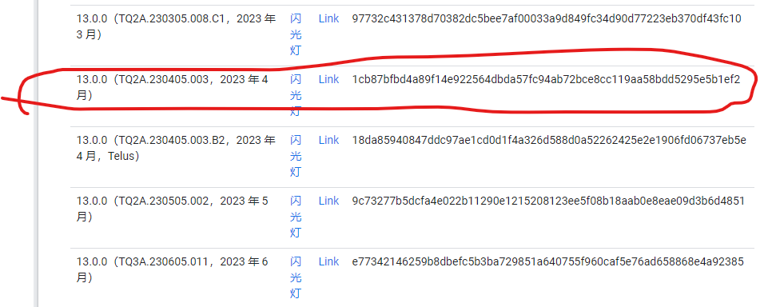

在解包 ``boot.img``的``boot.img-kernel`` 中可以看到内核版本号是``4.14.295-g84b42e6a786c-ab9578266``
```
Rinitcall_debugLinux version 4.14.295-g84b42e6a786c-ab9578266 (android-build@abfarm-2004-0229) (A!� (7284624, based on r416183b) clangv�12.0.5 (https://d�H.googlesource.com/toolchain/llvm-project c935d99d7cf2016289302412d708641d52d2f7ee), LLDo/�tbot/srcuZi9outmO/lldq�!) #1 SMP PREEMPT Wed Feb 8 04:47:36 UTC 2023
```

其中``4.14.295``在 ``Markfile``中

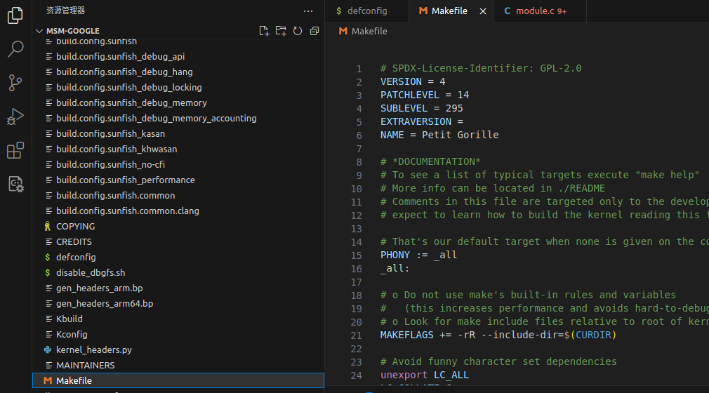

而 ``84b42e6a786c``是提交的``id``,可以进入``private/msm-google``使用 ``git log 84b42e6a786c``进行查看:

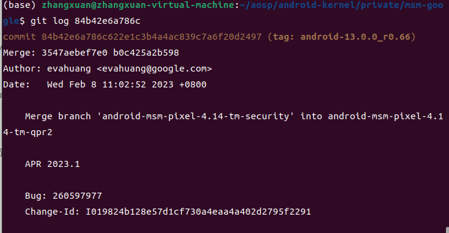

如果你想完全一致,可以使用``git checkout 84b42e6a786c``来检出这个提交。

所以现在,你应该会带着骂人的话,重新再刷一遍手机,以达到 手机系统的内核与你编译的内核一致


>如果刷机出现了Cannot load Android system. Your data may be corrupt....提示数据损坏等消息,
它会让你 erase(擦除) userdata 选择一下就可以。这可能是跟降级更新有关系。好吧,这又是我踩到的坑

### 测试自编译内核

测试的内核不包含``kernelSu``,没错,我删掉重新编译了,你们可以不删除直接测。

按照下面命令进行测试内核:
```
adb reboot fastboot

fastboot reboot bootloader
fastboot boot Image.lz4-dtb
```


但是此时你会发现,**卡在启动log页面了**


## 解决内核模块与内核对应问题

通过 ``dmesg`` 查看内核日志发现了大量的:

```
...
[   28.861688] init: Control message: Could not find 'android.hardware.sensors@2.0::ISensors/default' for ctl.interface_start from pid: 652 (/system/bin/hwservicemanager)
[   28.861963] adsprpc: bad ioctl: -1072934383
[   28.871840] adsprpc: bad ioctl: -1072934383
[   28.883564] adsprpc: bad ioctl: -1072934383
[   28.892785] adsprpc: bad ioctl: -1072934383
[   28.899394] adsprpc: bad ioctl: -1072934383
[   28.915591] adsprpc: bad ioctl: -1072934383
[   28.924410] adsprpc: bad ioctl: -1072934383
[   28.927512] adsprpc: bad ioctl: -1072934383
[   28.947871] adsprpc: bad ioctl: -1072934383
```


跟踪源码得知某个 ``case``条件没有匹配上。 

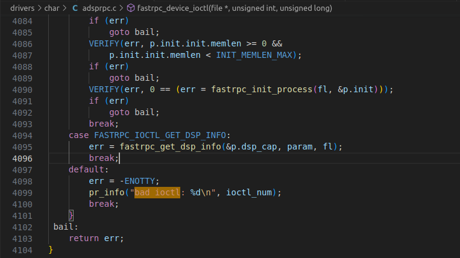

那么肯定是 ``vendor``的内核模块 与 ``kernel``启动内核不匹配,供应商修改了 内核代码。

这应该就是内核碎片话问题。 下游 ``vendor`` 调用上游 ``kernel``代码不匹配

我想过几种方案啊:
- 修改vendor分区
(尝试 mount 进行修改,可惜是只读的,放弃)

- 手动编译vendor (看不懂 markfile 配置,放弃)

- 修改版本检测代码(尝试修改 modversions 和 module magic 校验,失败,原因不明,但是错误日志确实少了很多)


以上全部失败,耗费好几天时间,把我折磨的欲仙欲死,一度想放弃

最后研究如何将内核模块整合在 ``boot``里面,可算有了思路。

两种方案:
1. 将内核模块直接整合到启动内核中
2. ramdisk 整合


在研究这两种方案的时候,我查阅了很多资料,发现有一个特别棒的博客

来自``seeFlowerX``的:``https://blog.seeflower.dev/archives/174``。

所以我采用 ``ramdisk`` 进行整合驱动内核模块

### 了解供应商ramdisk模块加载位置

参考资料: ``https://source.android.com/docs/core/architecture/kernel/kernel-module-support?hl=zh-cn``

通用内核映像 (GKI) 可能不包含使设备能够装载分区所需的驱动程序支持。为了使设备能够装载分区并继续启动，增强了第一阶段 init，用于加载 ramdisk 上的内核模块。ramdisk 被拆分为通用 ramdisk 和供应商 ramdisk。供应商内核模块存储在供应商 ramdisk 中。内核模块加载的顺序可以配置。


注意一些主要内容: ramdisk 拆分成 通用 ramdisk 和 供应商 ramdisk。 供应商内核模块存储在供应商 ramdisk 中

关于模块位置的描述:
（作为供应商 ramdisk 存储在供应商启动分区中）包含以下组件：
- 第一阶段 init 供应商内核模块，位于 /lib/modules/
- modprobe 配置文件，位于 /lib/modules/：modules.dep、modules.softdep、modules.alias、modules.options
- 一个 modules.load 文件，用于指示在第一阶段 init 期间加载的模块及相应的加载顺序，位于 /lib/modules/
- 供应商恢复内核模块，用于 A/B 和虚拟 A/B 设备，位于 /lib/modules/
- modules.load.recovery，用于指示要加载的模块及相应的加载顺序，用于 A/B 和虚拟 A/B 设备，位于 /lib/modules

第二个 cpio 归档（作为 boot.img 的 ramdisk 随 GKI 提供，应用在第一个 cpio 归档之上）包含 first_stage_init 及其依赖的库。


**问题来了!!**
``ramdisk`` 是啥？它在哪里？

首先,关于``ramdisk``我并没有在 ``android sources``  中搜索到满意的描述,可能是属于``linux``内容？但是按照查找的资料来说 ``ramdisk`` 是种基于
``内存的磁盘``,用于提供访问速度。 在 ``android``中将``ramdisk``做为 开机时候的启动项,里面包含了``init`` 作为用户进程第一个执行程序。

ramdisk 接口可以看官方的描述:
```
https://source.android.com/docs/core/architecture/partitions/generic-boot?hl=zh-cn#boot-images-contents

通用 ramdisk 包含以下组件。

init
system/etc/ramdisk/build.prop
ro. PRODUCT .bootimg.* build道具
debug_ramdisk/ 、 mnt/ 、 dev/ 、 sys/ 、 proc/ 、 metadata/
first_stage_ramdisk/
debug_ramdisk/ 、 mnt/ 、 dev/ 、 sys/ 、 proc/ 、 metadata/
```

记住之前的一段话 ``（作为 boot.img 的 ramdisk 随 GKI 提供，应用在第一个 cpio 归档之上）包含 first_stage_init 及其依赖的库。``

那么``通用 ramdisk`` 应该是在 **boot.img** 中,使用 ``android image kitchen`` 解包后确实有这个文件:


打开看看:

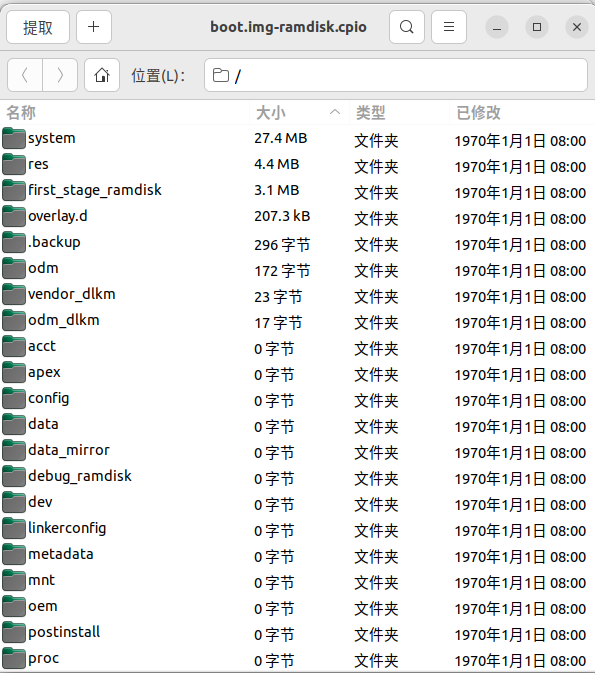

发现它跟我们``cd /``查看手机根目录的内容差不多。 并且按照网上一些零散的资料来看,``通用 ramdisk``会挂载到``根目录``

但是``供应商 ramdisk``在哪里呢？

``ramdisk``一般采用 ``cpio归档``,我们查看 ``android kernel`` 的 ``build/build.sh`` 脚本 搜索``.cpio``,你会发现:

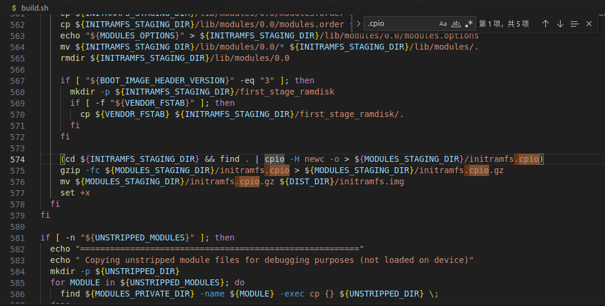

它会将``initramfs.cpio``打包成``initramfs.img``。

``initramfs.cpio``就是``供应商的ramdisk``,那么 ``initramfs.cpio``在哪里呢?

查看``${MODULES_STAGING_DIR}``这个变量,可以推断出它在``~/aosp/android-kernel/out/android-msm-pixel-4.14/staging/``中。

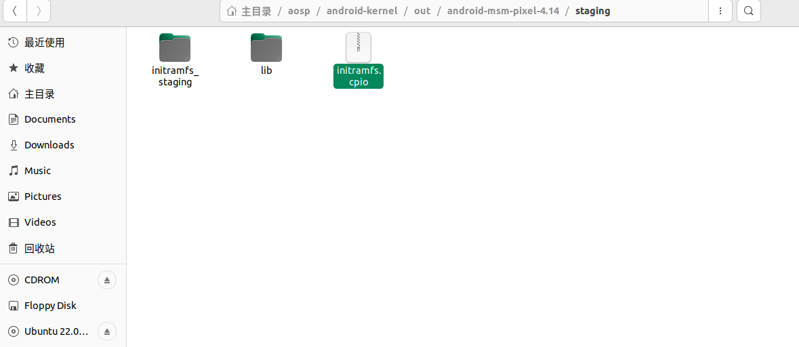

打开这个文件,你会发现只有``lib/modules``

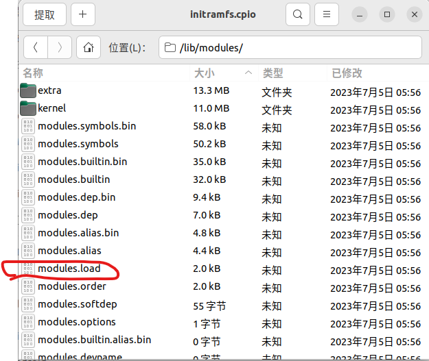

注意``modules.load``文件,这里面配置了加载的模块

```
kernel/fs/incfs/incrementalfs.ko
kernel/drivers/video/backlight/lcd.ko
kernel/drivers/soc/qcom/llcc_perfmon.ko
kernel/drivers/char/rdbg.ko
kernel/drivers/input/touchscreen/heatmap.ko
kernel/drivers/input/misc/drv2624.ko
kernel/drivers/media/rc/msm-geni-ir.ko
kernel/drivers/media/platform/msm/dvb/adapter/mpq-adapter.ko
kernel/drivers/media/platform/msm/dvb/demux/mpq-dmx-hw-plugin.ko
kernel/drivers/media/usb/gspca/gspca_main.ko
kernel/drivers/platform/msm/msm_11ad/msm_11ad_proxy.ko
kernel/techpack/audio/soc/pinctrl_wcd_dlkm.ko
kernel/techpack/audio/soc/pinctrl_lpi_dlkm.ko
kernel/techpack/audio/soc/swr_dlkm.ko
kernel/techpack/audio/soc/snd_event_dlkm.ko
kernel/techpack/audio/soc/swr_ctrl_dlkm.ko
kernel/techpack/audio/dsp/codecs/native_dlkm.ko
kernel/techpack/audio/dsp/q6_dlkm.ko
kernel/techpack/audio/dsp/usf_dlkm.ko
kernel/techpack/audio/dsp/adsp_loader_dlkm.ko
kernel/techpack/audio/dsp/q6_pdr_dlkm.ko
kernel/techpack/audio/dsp/q6_notifier_dlkm.ko
...
```

### 打包boot通用ramdisk和供应商ramdisk

现在问题来了,如何处理 ``boot通用ramdisk`` 和  ``供应商ramdisk`` 呢?

首先,你要知道一点,我们要做什么。 是不是就是能够将 **内核** 编译出来的 **内核模块** 能够加载进去,让手机能够开机？

而目前得到的资料来说,**供应商内核模块** 最终从 ``vendor/lib/modules``处加载。 可是``vendor``修改太困难,我们得从方便修改的``boot.img``出发。

所以要将 ``boot通用ramdisk`` 和  ``供应商ramdisk``  合并成一个 ``ramdisk``。

这里需要了解点知识,``boot.img``是由``mkbootimg``生成,您应该可以在``aosp``源码找到,或者从``out/host/linux-x86/bin/``的构建目录中发现这个工具。

``android imgage kitchen``其实也可以发现``mkbootimg``

查看``mkbootimg``命令

```
./mkbootimg  --help
usage: mkbootimg [-h] [--kernel KERNEL] [--ramdisk RAMDISK] [--second SECOND]
                 [--dtb DTB]
                 [--recovery_dtbo RECOVERY_DTBO | --recovery_acpio RECOVERY_ACPIO]
                 [--cmdline CMDLINE] [--vendor_cmdline VENDOR_CMDLINE]
                 [--base BASE] [--kernel_offset KERNEL_OFFSET]
                 [--ramdisk_offset RAMDISK_OFFSET]
                 [--second_offset SECOND_OFFSET] [--dtb_offset DTB_OFFSET]
                 [--os_version OS_VERSION] [--os_patch_level OS_PATCH_LEVEL]
                 [--tags_offset TAGS_OFFSET] [--board BOARD]
                 [--pagesize {2048,4096,8192,16384}] [--id]
                 [--header_version HEADER_VERSION] [-o OUTPUT]
                 [--vendor_boot VENDOR_BOOT] [--vendor_ramdisk VENDOR_RAMDISK]
                 [--vendor_bootconfig VENDOR_BOOTCONFIG]
                 [--gki_signing_algorithm GKI_SIGNING_ALGORITHM]
                 [--gki_signing_key GKI_SIGNING_KEY]
                 [--gki_signing_signature_args GKI_SIGNING_SIGNATURE_ARGS]
                 [--gki_signing_avbtool_path GKI_SIGNING_AVBTOOL_PATH]
```
在这里你需要提供几个重要的东西
- ``--kernel`` 内核的二进制文件,其实就是我们编译出的``Image.lz4``
- ``--ramdisk`` 这个最终就是我们要传递的 ``boot通用ramdisk`` 和  ``供应商ramdisk``合成的``ramdisk``
- ``dtb`` 我并没有研究这块,但是我们编译内核确实有``dtb.img``的产物
- ``--vendor_ramdisk`` 这个应用于 ``gki`` 内核,可以单独传入 ``供应商ramdisk``,我们并不是``gki内核``,所以不传
- .... 其余参数后续在说

这里我发现了 ``vendor_boot`` 和 ``vendor_ramdisk``。所以对于 **gki** 内核来说,``vendor ramdisk``应该转移到了``vendor_boot``。
而不是``boot ramdisk``中,当然我们并不是``gki内核``,所以我们需要将``boot通用ramdisk``和``vendor ramdisk``进行合并。

理论上,我们填好参数,就能够编译携带 ``供应商内核模块`` 的``boot.img``。

但是参考``seeFlowerX``这位大牛的博客,发现其实``android kernel``的``build/build.sh``拥有构建``boot.img``的能力

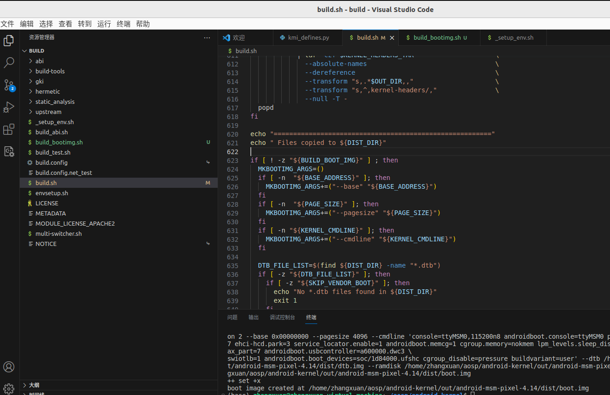

注意:``echo " Files copied to ${DIST_DIR}"`` 后面的内容,我们只需要在调用构建脚本的时候定义``BUILD_BOOT_IMG``变量,即可构建``boot.img``。

按照脚本上的注释来说:

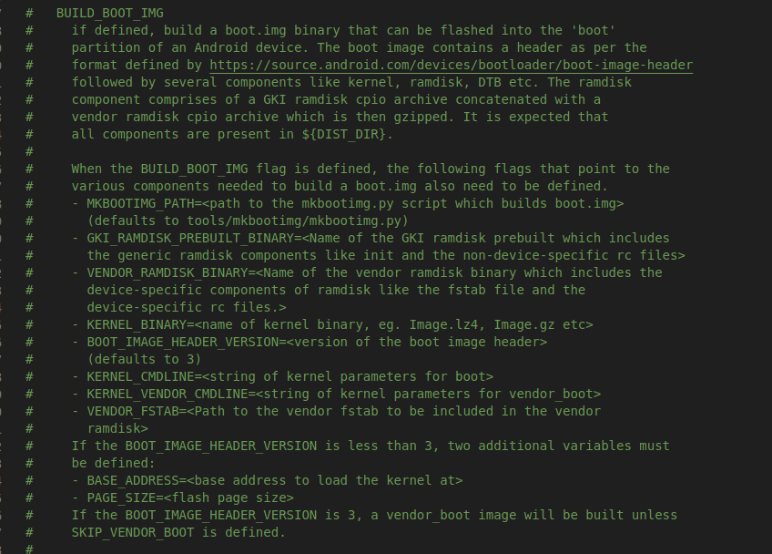

如果是非``gki``的镜像,我们需要传递下面几个参数:
```
# 是否构建 boot.img
BUILD_BOOT_IMG 

# mkbootimg 工具路径
MKBOOTIMG_PATH

# 对于 非 gki 内核来说,ramdisk 传递 boot 通用 ramdisk 。也就是 ``boot.img-ramdisk.gz``
VENDOR_RAMDISK_BINARY

# boot 内核参数
KERNEL_CMDLINE

# base 地址
BASE_ADDRESS

# 页面大小
PAGE_SIZE
```

### 编写构建bootimg脚本

由于``build/build.sh`` 脚本构建``boot.img``是需要编译 ``kernel`` 后才构建``boot``。但是我们现在是已经构建完了,如果在构建一次就会比较麻烦了。

所以我将关键用于构建``boot.img``的地方抽出,写了个``build_bootimg.sh``

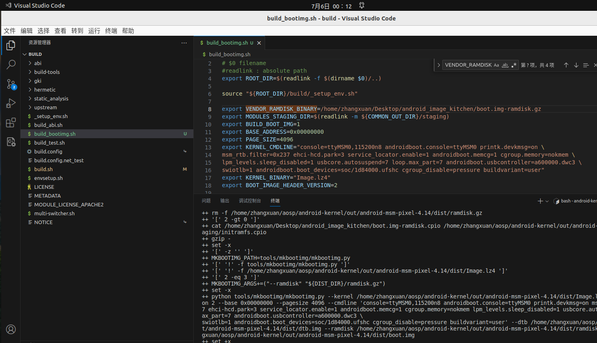


在此使用脚本之前,需要做下准备工作,比如有几个参数需要您传递:
```
export VENDOR_RAMDISK_BINARY=/home/zhangxuan/Desktop/android_image_kitchen/boot.img-ramdisk.gz
export BUILD_BOOT_IMG=1
export BASE_ADDRESS=0x00000000
export PAGE_SIZE=4096
export KERNEL_CMDLINE="console=ttyMSM0,115200n8 androidboot.console=ttyMSM0 printk.devkmsg=on \
msm_rtb.filter=0x237 ehci-hcd.park=3 service_locator.enable=1 androidboot.memcg=1 cgroup.memory=nokmem \
lpm_levels.sleep_disabled=1 usbcore.autosuspend=7 loop.max_part=7 androidboot.usbcontroller=a600000.dwc3 \ 
swiotlb=1 androidboot.boot_devices=soc/1d84000.ufshc cgroup_disable=pressure buildvariant=user"
```

这些参数如何得来呢? 之前说过构建``boot.img``可以用``mkbootimg``。其实也有个解包的工具``unbootimg``。
这个也在``android image kitchen``中,所以我们只需要调用 ``android image kitchen``的``unpackimg.sh``脚本,它会输出这些参数,随便
还可以获取到``split_img/boot.img-ramdisk.gz``文件

将出厂镜像``boot.img``放入 ``aik``中,调用``unpackimg.sh``你会得到:

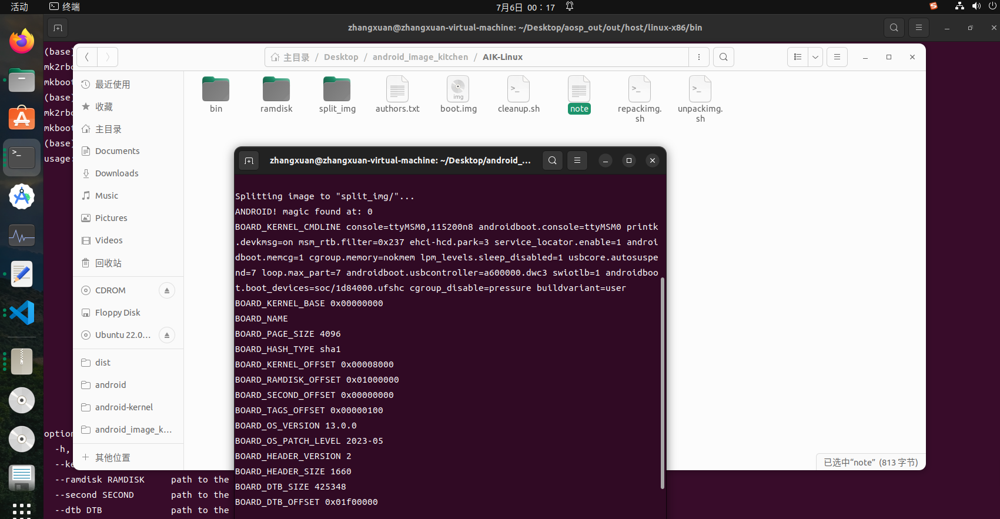


下面脚本有点长,但你只需要修改最上面的参数:
``` shell

# $0 filename 
#readlink : absolute path
export ROOT_DIR=$(readlink -f $(dirname $0)/..)

source "${ROOT_DIR}/build/_setup_env.sh"
export MODULES_STAGING_DIR=$(readlink -m ${COMMON_OUT_DIR}/staging)


export VENDOR_RAMDISK_BINARY=/home/zhangxuan/Desktop/android_image_kitchen/AIK-Linux/split_img/boot.img-ramdisk.cpio.gz
export BUILD_BOOT_IMG=1
export BASE_ADDRESS=0x00000000
export PAGE_SIZE=4096
export KERNEL_CMDLINE="console=ttyMSM0,115200n8 androidboot.console=ttyMSM0 printk.devkmsg=on \
msm_rtb.filter=0x237 ehci-hcd.park=3 service_locator.enable=1 androidboot.memcg=1 cgroup.memory=nokmem \
lpm_levels.sleep_disabled=1 usbcore.autosuspend=7 loop.max_part=7 androidboot.usbcontroller=a600000.dwc3 \ 
swiotlb=1 androidboot.boot_devices=soc/1d84000.ufshc cgroup_disable=pressure buildvariant=user"
export KERNEL_BINARY="Image.lz4"
export BOOT_IMAGE_HEADER_VERSION=2

echo "=============================="
echo "env variables:"
echo "ROOT_DIR :${ROOT_DIR} "
echo "COMMON_OUT_DIR :${COMMON_OUT_DIR} "
echo "MODULES_STAGING_DIR :${MODULES_STAGING_DIR} "
echo "OUT_DIR :${OUT_DIR} "
echo "DIST_DIR :${DIST_DIR} "
echo "BUILD_BOOT_IMG :${BUILD_BOOT_IMG} "
echo "BASE_ADDRESS :${BASE_ADDRESS} "
echo "PAGE_SIZE :${PAGE_SIZE} "
echo "KERNEL_CMDLINE :${KERNEL_CMDLINE} "
echo "VENDOR_RAMDISK_BINARY :${VENDOR_RAMDISK_BINARY} "
echo "KERNEL_BINARY :${KERNEL_BINARY} "
echo "BOOT_IMAGE_HEADER_VERSION :${BOOT_IMAGE_HEADER_VERSION} "

# 是否构建 boot.img
if [ ! -z "${BUILD_BOOT_IMG}" ] ; then

  # mkbootimg 参数列表
	MKBOOTIMG_ARGS=()

  # 基础参数
	if [ -n  "${BASE_ADDRESS}" ]; then
		MKBOOTIMG_ARGS+=("--base" "${BASE_ADDRESS}")
	fi
	if [ -n  "${PAGE_SIZE}" ]; then
		MKBOOTIMG_ARGS+=("--pagesize" "${PAGE_SIZE}")
	fi
	if [ -n "${KERNEL_CMDLINE}" ]; then
		MKBOOTIMG_ARGS+=("--cmdline" "${KERNEL_CMDLINE}")
	fi

  # 设置 --dtb 为内核构建出来的
	DTB_FILE_LIST=$(find ${DIST_DIR} -name "*.dtb")
	if [ -z "${DTB_FILE_LIST}" ]; then
		if [ -z "${SKIP_VENDOR_BOOT}" ]; then
			echo "No *.dtb files found in ${DIST_DIR}"
			exit 1
		fi
	else
		cat $DTB_FILE_LIST > ${DIST_DIR}/dtb.img
		MKBOOTIMG_ARGS+=("--dtb" "${DIST_DIR}/dtb.img")
	fi

  # VENDOR_RAMDISK_BINARY 为 boot 通用 ramdisk 的路径
  # initramfs.cpio 为 内核构建出来的 供应商 ramdisk
	set -x
	MKBOOTIMG_RAMDISKS=()
	for ramdisk in ${VENDOR_RAMDISK_BINARY} \
		       "${MODULES_STAGING_DIR}/initramfs.cpio"; do
		if [ -f "${DIST_DIR}/${ramdisk}" ]; then
			MKBOOTIMG_RAMDISKS+=("${DIST_DIR}/${ramdisk}")
		else
			if [ -f "${ramdisk}" ]; then
				MKBOOTIMG_RAMDISKS+=("${ramdisk}")
			fi
		fi
	done

  echo "MKBOOTIMG_RAMDISKS len:${#MKBOOTIMG_RAMDISKS[@]} \
    MKBOOTIMG_RAMDISKS[*]:${MKBOOTIMG_RAMDISKS[*]}
    "

  # 将 boot ramdisk 和 vendor ramdisk 尝试解压 gzip 提取 cpio归档 
	for ((i=0; i<"${#MKBOOTIMG_RAMDISKS[@]}"; i++)); do
		CPIO_NAME="$(mktemp -t build.sh.ramdisk.XXXXXXXX)"
		if gzip -cd "${MKBOOTIMG_RAMDISKS[$i]}" 2>/dev/null > ${CPIO_NAME}; then
			MKBOOTIMG_RAMDISKS[$i]=${CPIO_NAME}
		else
			rm -f ${CPIO_NAME}
		fi
	done

  # 将  boot ramdisk 和 vendor ramdisk 合并成一个 ramdisk
  rm -f ${DIST_DIR}/ramdisk.gz
	if [ "${#MKBOOTIMG_RAMDISKS[@]}" -gt 0 ]; then
		cat ${MKBOOTIMG_RAMDISKS[*]} | gzip - > ${DIST_DIR}/ramdisk.gz
	elif [ -z "${SKIP_VENDOR_BOOT}" ]; then
		echo "No ramdisk found. Please provide a GKI and/or a vendor ramdisk."
		exit 1
	fi
	set -x

  # mkbootimg 
	if [ -z "${MKBOOTIMG_PATH}" ]; then
		MKBOOTIMG_PATH="tools/mkbootimg/mkbootimg.py"
	fi
	if [ ! -f "$MKBOOTIMG_PATH" ]; then
		echo "mkbootimg.py script not found. MKBOOTIMG_PATH = $MKBOOTIMG_PATH"
		exit 1
	fi

	if [ ! -f "${DIST_DIR}/$KERNEL_BINARY" ]; then
		echo "kernel binary(KERNEL_BINARY = $KERNEL_BINARY) not present in ${DIST_DIR}"
		exit 1
	fi

	if [ "${BOOT_IMAGE_HEADER_VERSION}" -eq "3" ]; then
		if [ -f "${GKI_RAMDISK_PREBUILT_BINARY}" ]; then
			MKBOOTIMG_ARGS+=("--ramdisk" "${GKI_RAMDISK_PREBUILT_BINARY}")
		fi

		if [ -z "${SKIP_VENDOR_BOOT}" ]; then
			MKBOOTIMG_ARGS+=("--vendor_boot" "${DIST_DIR}/vendor_boot.img" \
				"--vendor_ramdisk" "${DIST_DIR}/ramdisk.gz")
			if [ -n "${KERNEL_VENDOR_CMDLINE}" ]; then
				MKBOOTIMG_ARGS+=("--vendor_cmdline" "${KERNEL_VENDOR_CMDLINE}")
			fi
		fi
	else
		MKBOOTIMG_ARGS+=("--ramdisk" "${DIST_DIR}/ramdisk.gz")
	fi

	set -x
	python "$MKBOOTIMG_PATH" --kernel "${DIST_DIR}/${KERNEL_BINARY}" \
		--header_version "${BOOT_IMAGE_HEADER_VERSION}" \
		"${MKBOOTIMG_ARGS[@]}" -o "${DIST_DIR}/boot.img"
	set +x

	echo "boot image created at ${DIST_DIR}/boot.img"
fi

```

其中还要注意一点,我并没有指定``MKBOOTIMG_PATH`` 路径,因为它默认是 ``"tools/mkbootimg/mkbootimg.py"``

## 

最终操作 ``fastboot flash boot boot.img``