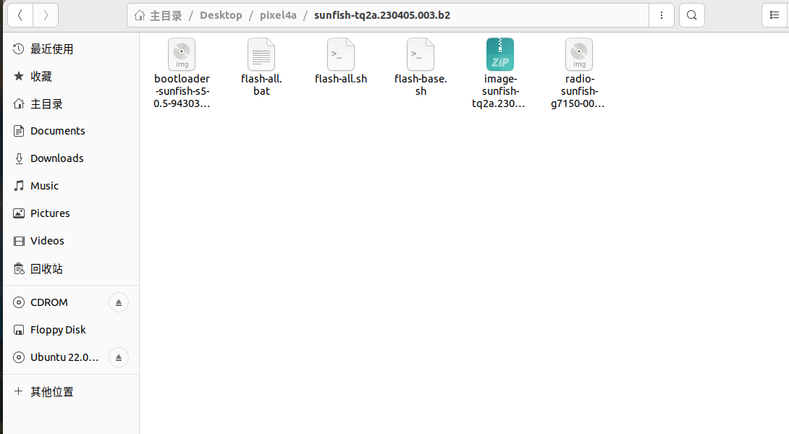
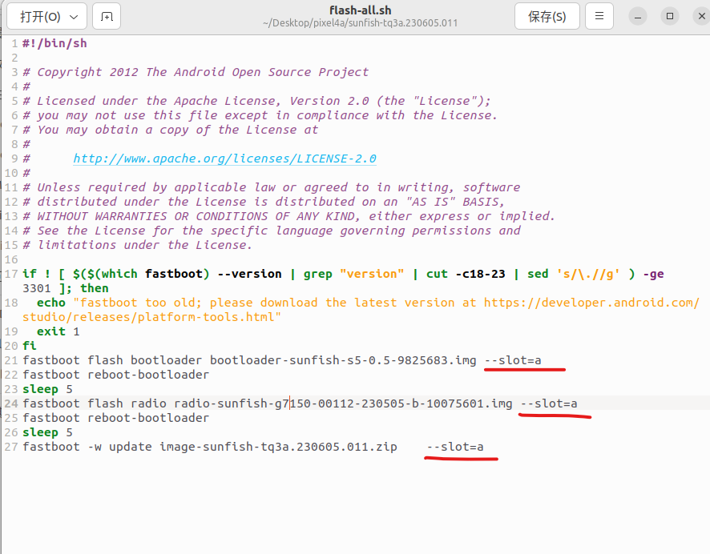

# android-pixel4a-刷机系列-(6)最终的修补

使用 ``userdebug`` 构建的 ``aosp`` 很容易被检测。

``debug_cat``大佬 修改 ``aosp`` 
[http://www.debuglive.cn/article/1076980560838000640](http://www.debuglive.cn/article/1076980560838000640)
修改root 特征,并修正一些系统指纹特征

(您需要将 ``user`` 构建配置 和 ``userdebug`` 配置进行比较,争取还原一致)

这种考验技术功底,``user`` 构建配置 和 ``userdebug`` 差异比较多,只好放弃。

但是都做到这个地步了，所以我们只能尝试用 官方出厂镜像修改,就不折腾``aosp``了,毕竟改了后还得重新编译。


## 刷入出厂镜像


里面包含了完整的驱动二进制文件等等。

我们下载后进行解压(注意区分手机型号):
```
 wget "https://dl.google.com/dl/android/aosp/sunfish-tq3a.230605.011-factory-e7734214.zip?hl=zh-cn" -O "sunfish-tq2a.230405.003.b2-factory-18da8594.zip"

 unzip sunfish-tq2a.230405.003.b2-factory-18da8594.zip 

```



从外部来看这些文件
```
# 里面包含了所有分区镜像
image-sunfish-tq2a.230405.003.b2.zip

# bootloader 引导镜像
bootloader-sunfish-s5-0.5-9430386.img

# 驱动镜像
radio-sunfish-g7150-00108-230117-b-9497111.img

# 刷机脚本
flash-all.sh
```

可以先解压 ``image-sunfish-tq2a.230405.003.b2.zip`` 为后续分析镜像做准备

### 刷机
查看里面的镜像
```
~/pixel4a/image-sunfish-tq2a.230405.003.b2$ ls 

android-info.txt  product.img      system.img        vbmeta_system.img
boot.img          super_empty.img  system_other.img  vendor.img
dtbo.img          system_ext.img   vbmeta.img

```

首先进行刷机
```
# fastboot -w update 命令 需要用到 ANDROID_PRODUCT_OUT 变量,我设置的是解压后的镜像文件,理论上随便设置好像也可以
export ANDROID_PRODUCT_OUT="~/pixel4a/sunfish-tq2a.230405.003.b2/image-sunfish-tq2a.230405.003.b2/"

sh flash-all.sh
```

刷机成功后,变成真正初始状态了。

### (救砖)特别注意

如果你出现刷入出厂镜像 开机不断重启几次 回到 ``fastboot``界面,并且出现红色感叹号。而之前是可以成功刷入这个镜像的,那么可能你分区出现了损坏

**这其实是我出现的问题,当时把我吓尿了**

原因:个人觉得跟 之前使用 ``userdebug``版本有关系。
因为我设置了 ``adb remount`` 并覆盖了 ``vendor``分区中的模块,因为``remount``采用的``overlayfs``堆叠的方式,具体可以查看一些资料

所以可能 ``overlayfs``挂载的 ``vendor``依旧未卸载？？？,导致``vendor``的模块不一致？？？

这是我觉得很有可能得事情,可是网上我搜不到任何关于这方面的资料,问``chatgpt``也无济于事。

为了解决这个问题,我考虑了几种方案
1.刷机刷到``b``槽,并激活,但是之前挂载的``vendor``怎么办?所以我放弃了这种
2.刷入完整的 OTA 映像

我采用的第二种:参考官方文档
[https://developers.google.com/android/ota?hl=zh-cn#sunfish](https://developers.google.com/android/ota?hl=zh-cn#sunfish)


```
# 首先下载
wget "https://dl.google.com/dl/android/aosp/sunfish-ota-tq3a.230605.011-a27fab47.zip?hl=zh-cn" -O "sunfish-ota-tq3a.230605.011-a27fab47.zip"
```

下载后如何刷进去呢？这并不是寻常带``img``镜像的包


按照官方介绍说需要进入 ``recovery``模式。

参考:[pixel帮助文档](https://support.google.com/pixelphone/answer/4596836?hl=zh-Hans#zippy=%2C%E4%BD%BF%E7%94%A8%E6%89%8B%E6%9C%BA%E7%9A%84%E6%8C%89%E9%92%AE%E9%AB%98%E7%BA%A7)

```
1.如果您的手机处于开机状态，请按住电源按钮将其关机。
2.同时按住音量调低按钮和电源按钮 10-15 秒。
3.如果按住这两个按钮的时间过长，手机会重启。如果出现这种情况，请从第 1 步重试。
4.使用音量按钮切换菜单选项，直到屏幕上显示“Recovery mode”（恢复模式）。按一次电源按钮即可选择该选项。
5.屏幕上会随即显示“No command”（无命令）。按住电源按钮。在按住电源按钮的同时，按音量调高按钮，然后快速松开这两个按钮。
```

然后按音量键进入 ``apply adb`` ,这样你就可以在 ``recovery``中使用 ``adb``命令

想要将 ``oat``通过 ``adb``进行刷入,请使用``adb sideload sunfish-ota-tq3a.230605.011-a27fab47.zip``   进行刷入

接下来就耐心等待片刻。

接下重新刷入之前的出厂镜像进行测试  ``./flash-all.sh`` 

(如果你进入的是``fastbootd``,那么还需要运行``fastboot reboot bootloader``)

可能它会默认给你刷到``b``槽,为了刷到``a``槽,请在``flash-all.sh``的脚本进行更改




## 修改内核
在出厂镜像中

```
~/pixel4a/image-sunfish-tq2a.230405.003.b2$ ls 

android-info.txt  product.img      system.img        vbmeta_system.img
boot.img          super_empty.img  system_other.img  vendor.img
dtbo.img          system_ext.img   vbmeta.img

```
需要关注两个 ``boot.img`` 和 ``vendor.img``。 这两个分区包含了 ``启动内核`` 以及 ``内核模块``

之前说过``dessert内核`` 中的 ``内核模块`` 并不是通过 ``kmi`` 内核模块接口来与``通用内核(ACK)``进行交互。

由于内核碎片化,导致一旦 下游的 ``内核模块`` 更改,其上游的内核必须适配,后续也很难进行更新修复

所以理论上如果将我们编译好的``启动内核``进行替换 ``boot.img`` 理论上会出现些问题,
比如 ``wifi`` 和 ``相机``等会出现些许情况,甚至可能无法开机


### 选择正确的内核镜像

出厂镜像中的内核版本 可能与 我们当前的不一致,对于非``gki``设备,我们应该争取一致,防止出现预料之外的错误。
(当然,如果是 ``gki``设备,只需要关注 ``kmi``版本即可)

首先进行比对内核版本:

通过 ``grep -a 'Linux version' Image.lz4-dtb``查看我们编译的内核版本
```
initcall_debugLinux version 4.14.295_KernelSU-g0856b718defc 
```
然后再解压原厂``boot.img``,通过``grep -a "Linux version" boot.img-kernel``
```
nitcall_debugLinux version 4.14.302-g1c5bb331fccc-ab9989803 
```
发现有些许差距。

我们进入 git 仓库中查看分支
```
cd ~/aosp/android-kernel/.repo/manifests.git

git branch -r|grep sunfish
  m/android-msm-sunfish-4.14-android13-qpr2 -> origin/android-msm-sunfish-4.14-android13-qpr2
  origin/android-msm-sunfish-4.14-android10-d4
  origin/android-msm-sunfish-4.14-android11
  origin/android-msm-sunfish-4.14-android11-qpr2
  origin/android-msm-sunfish-4.14-android11-qpr3
  origin/android-msm-sunfish-4.14-android12
  origin/android-msm-sunfish-4.14-android12-qpr1
  origin/android-msm-sunfish-4.14-android12-v2-beta-2
  origin/android-msm-sunfish-4.14-android12L
  origin/android-msm-sunfish-4.14-android13
  origin/android-msm-sunfish-4.14-android13-qpr1
  origin/android-msm-sunfish-4.14-android13-qpr2

``` 

发现基于 ``android13``有3个
```
  origin/android-msm-sunfish-4.14-android13
  origin/android-msm-sunfish-4.14-android13-qpr1
  origin/android-msm-sunfish-4.14-android13-qpr2
```
当前我们选的是 ``origin/android-msm-sunfish-4.14-android13-qpr2``

也就是说这已经是最新的了。

为了对应上 ``内核版本`` 我们得寻找最适配的出厂镜像。
先看看 ``log`` 最近提交的记录:
```
git log
commit 36819067aacd91475c699a78d41580f7a17d74b7 (HEAD -> default, origin/android-msm-sunfish-4.14-android13-qpr2, m/android-msm-sunfish-4.14-android13-qpr2)
Author: Bill Yi <byi@google.com>
Date:   Mon Mar 20 13:07:58 2023 -0700

    Manifest for android-msm-sunfish-4.14-android13-qpr2

```
March 20 也就是 3月份的时候

我并没有比较好的办法区分要下哪一个,只能在最近的日期一个个进行尝试。

还好运气不错,在基于 3 月份镜像的后面,正好找到。


如果选的版本和你当前的不匹配。
那么,你应该会带着骂人的话,重新再刷一遍手机。


>如果刷机出现了Cannot load Android system. Your data may be corrupt....提示数据损坏等消息,可以尝试使用 ``fastboot erase userdata``。
它会让你 erase(擦除) userdata 选择一下就可以。这可能是跟降级更新有关系,好吧,这又是我踩到的坑

### 测试自编译内核

测试的内核不包含``kernelSu``,没错,我删掉重新编译了,你们可以不删除直接测。

按照下面命令进行测试内核:
```
adb reboot fastboot

fastboot reboot bootloader
fastboot boot Image.lz4-dtb
```

但是此时你会发现,卡在启动页面了,无法启动。这就是 碎片化内核的问题。
下游的``内核模块``不和``启动内核匹配``。
所以我们接下来得重打包 ``vendor.img`` ,替换内核模块

